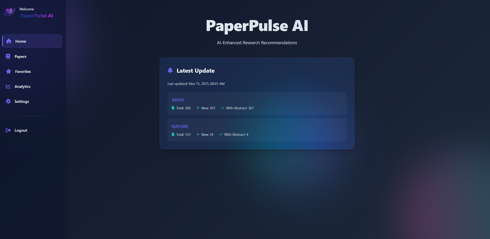
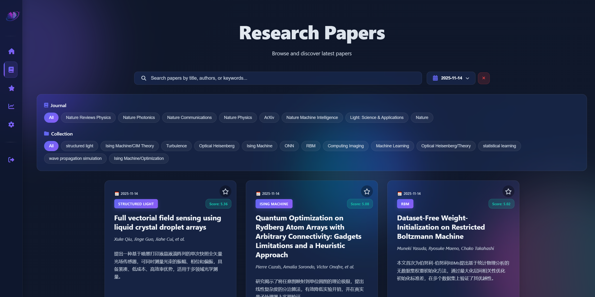

# Daily Paper RSS AI Enhance

A **locally-run** academic paper recommendation system that fetches papers via RSS feeds (arXiv, Nature, etc.), uses AI to generate structured summaries and intelligently ranks papers based on Zotero library similarity through embedding-based matching—all processed locally with personalized collection filtering.

**本地化的学术论文推荐系统，支持RSS订阅（arXiv、Nature等），通过AI生成结构化摘要并基于Zotero文献库进行智能排序，所有数据在本地处理。**

## Code is under testing and will be open-source soon.
**本人第一次在github上上传代码，不知道是否有不合适的地方，如果有感谢指出**

## ✨ Key Features

🎯 **Local Processing (When using local ai provider like Ollama)**
- All data fetched and processed locally on your machine
- No cloud dependencies - full control over your data
- JSONL-based storage for transparency and portability

🤖 **AI-Powered Enhancement**
- Structured summarization using OpenAI-compatible LLMs
- Generates: TL;DR, motivation, method, results, and conclusion
- Cost-effective: With the help of zotero recommendation, only generate AI content for papers that are relevant to your existing Zotero library
- Configurable models (default: qwen3-30b-a3b-instruct-2507, deepseek-chat, etc.)

📚 **Smart Zotero Integration**
- Ranks papers by similarity to your existing Zotero library
- Uses embedding models for semantic matching (default: Qwen3-Embedding-8B)
- Time-decay weighting for recent additions
- Automatic collection detection and re-ranking

📡 **Multi-Source RSS Support**
- **arXiv**: Physics, Quantum Physics, Condensed Matter, Nonlinear Sciences, AI, CV, etc.
- **Nature**: Nature, Nature Photonics, Nature Physics, Nature Communications, etc.
- Extensible architecture for adding more sources

🌐 **Clean Web Interface**
- Search and filter by collections
- Date range filtering
- Favorite system
  

## 📸 Screenshot
### Home Page

### Papers Page
- Dates, journal, your zotero collection filter
- Clear zotero collection tag on each card


### Paper Details Page

### Favorites Page


## 🚀 Quick Start

### Prerequisites

- Python 3.10+
- [uv](https://github.com/astral-sh/uv) package manager
- OpenAI-compatible API access
- Zotero account with API key

### Installation

1. **Clone the repository**
```bash
git clone https://github.com/yourusername/Daily_Paper_RSS_AI_Enhance.git
cd Daily_Paper_RSS_AI_Enhance
```

2. **Install dependencies**
```bash
uv sync
```

3. **Set up environment variables**

Create a `.env` file in the project root:

```bash
# New-API (required, alternatively any openai-compatible provider)
NEWAPI_KEY_AD=your_newapi_key
NEWAPI_BASE_URL=https://127.0.0.1:yourport/v1

# Zotero API (required)
ZOTERO_KEY_AD=your_zotero_api_key
ZOTERO_ID=your_zotero_user_id

# Nature API (optional, only if fetching Nature papers)
NATURE_API_KEY=your_nature_api_key
```

**Getting your keys:**
- **New-API Key and Base URL**: Generate at [https://github.com/QuantumNous/new-api](https://github.com/QuantumNous/new-api). New-API is an open-source AI gateway that provides access to multiple AI providers (*Online*: OpenAI, Gemini, DeepSeek, Qwen, SiliconFlow; *Local*: Ollama, LMstudio, etc.)
- **Zotero User ID**: Get it from [https://www.zotero.org/settings/keys](https://www.zotero.org/settings/keys)
- **Zotero API Key**: Generate at [https://www.zotero.org/settings/keys/new](https://www.zotero.org/settings/keys/new) (needs read access)
- **Nature API Key**: Apply at [Springer Nature API Portal](https://dev.springernature.com/)

1. **Configure RSS sources (optional)**

Run `main.py` to customize:
- RSS sources and categories
- LLM model name
- Embedding model
- Output language
- Maximum workers

### Usage

#### Daily Run （Use Windows Schedule）

```bash
uv run main.py
#args
--sources # The RSS sources and categories to fetch (e.g., arxiv:physics+quant-ph+cond-mat+nlin,nature:nature+nphoton+ncomms)
--model_name # The model name to generate ai content (e.g., qwen3-30b-a3b-instruct-2507)
--embedding_model # The model name to generate embeddings (e.g., qwen3-embedding-8b)
--language "en" # The language to generate content in (e.g., English, Chinese)
--max_workers "4" # the maximum number of workers to use for generating ai content
```

This will:
1. Fetch latest papers from configured RSS sources
2. Rank papers using Zotero library embeddings
3. Generate AI summaries for relevant papers
<!-- 4. Update the web interface -->

#### Weekly Collection Check（Use Windows Schedule）

```bash
uv run main_week_check.py
--model_name # The model name to generate ai content (e.g., qwen3-30b-a3b-instruct-2507t)
--embedding_model # The model name to generate embeddings (e.g., qwen3-embedding-8b)
--language "en" # The language to generate content in (e.g., English, Chinese)
--max_workers "4" # the maximum number of workers to use for generating ai content
```

Checks for new Zotero collections and re-ranks all existing papers.

<!-- #### View Results

Start a local web server:
```bash
python -m http.server 8000
```

Then visit `http://localhost:8000` in your browser.

Or simply open `index.html` directly in your browser. -->

## 📁 Project Structure

```
Daily_Paper_RSS_AI_Enhance/
├── ai/                          # AI enhancement and ranking modules
summarization
│   ├── enhance.py               # LLM-based paper 
│   ├── structure.py             # Data structures for AI
│   ├── system.txt               # System prompt template
│   ├── template.txt             # User prompt template
ranking
│   └── zotero_recommender.py    # Embedding-based Zotero output

├── fetcher/                     # RSS fetching modules
│   └── rss_fetcher.py           # Generic multi-source RSS fetcher
├── data/                        # Paper data storage (JSONL)
│   └── cache/                   # RSS cache and update logs
├── assets/                      # Web assets
│   └── file-list.txt            # List of data files for UI
├── css/                         # Stylesheets (auto-generated)
├── js/                          # JavaScript for web UI (auto-generated)
├── index.html                   # Main web interface
├── main.py                      # Main entry point
├── main_week_check.py           # Weekly collection checker
├── logger_config.py             # Logging configurationscript
├── pyproject.toml               # Project dependencies
└── README.md                    # This file
```

## 🔧 Configuration

### RSS Sources

Modify the `--sources` parameter in `run.bat`:

```bash
--sources "arxiv:physics+quant-ph+cond-mat+nlin,nature:nature+nphoton+ncomms"
```

Format: `source:category1+category2+category3,source2:category1+category2`

**Available arXiv categories:**
- `physics` - Physics
- `quant-ph` - Quantum Physics
- `cond-mat` - Condensed Matter
- `nlin` - Nonlinear Sciences
- `cs.AI` - Artificial Intelligence
- `cs.CV` - Computer Vision
- `cs.CL` - Computation and Language
- See full list at [arXiv Categories](https://arxiv.org/category_taxonomy)

**Available Nature journals:**
- `nature` - Nature
- `nphoton` - Nature Photonics
- `nphys` - Nature Physics
- `ncomms` - Nature Communications
- `natrevphys` - Nature Reviews Physics
- `lsa` - Light: Science & Applications
- `natmachintell` - Nature Machine Intelligence
- See full list at [Nature Portfolio](https://www.nature.com/siteindex)

### LLM Models

Modify `--model_name` in `run.bat`:

```bash
--model_name "qwen3-30b-a3b-instruct-2507"
# or
--model_name "gpt-oss-20b"
# or any OpenAI-compatible model
```

### Embedding Models

Modify `--embedding_model` in `run.bat`:

```bash
--embedding_model "text-embedding-3-small"
# or
--embedding_model "qwen3-embedding-8b"
```

### Output Language

Modify `--language` in `run.bat`:

```bash
--language "Chinese"
# or
--language "English"
```

## 🧪 Advanced Usage

### Python API

You can also use the modules programmatically:

```python
from fetcher.rss_fetcher import rss_fetcher_main
from ai.zotero_recommender import zotero_recommender_main
from ai.enhance import enhance_main

# Fetch papers
rss_fetcher_main(
    output='2025-11-03',
    output_dir='data',
    sources='arxiv:cs.AI+cs.CV'
)

# Rank papers
zotero_recommender_main(
    data='2025-11-03',
    data_dir='data',
    embedding_model='text-embedding-3-small'
)

# Enhance with AI
enhance_main(
    data='2025-11-03',
    data_dir='data',
    model_name='gpt-4o',
    language='English',
    max_workers=5
)
```

### Custom Workflow

```bash
# Fetch only
uv run python -c "from fetcher.rss_fetcher import rss_fetcher_main; rss_fetcher_main()"

# Rank only
uv run python -c "from ai.zotero_recommender import zotero_recommender_main; zotero_recommender_main()"

# Enhance only
uv run python -c "from ai.enhance import enhance_main; enhance_main()"
```

## 📊 Data Format

Papers are stored in JSONL format with the following structure:

```json
{
  "journal": "Nature Photonics",
  "id": "10.1038/s41566-024-01234-5",
  "pdf": "https://www.nature.com/articles/s41566-024-01234-5.pdf",
  "abs": "https://doi.org/10.1038/s41566-024-01234-5",
  "title": "Paper Title",
  "summary": "Abstract text...",
  "authors": ["Author1", "Author2"],
  "published": "2025-11-03",
  "category": "Quantum optics",
  "score": {
    "Collection1": 8.5,
    "Collection2": 6.2,
    "max": 8.5
  },
  "collection": ["Collection1"],
  "AI": {
    "tldr": "One-sentence summary",
    "motivation": "Why this research...",
    "method": "How they did it...",
    "result": "What they found...",
    "conclusion": "Final thoughts..."
  }
}
```


## 📋 TODO

- [ ] Add more RSS sources (Science, PNAS, Physical Review Letters, etc.)
- [ ] Add data analysis and visualization page

## 🐛 Known Issues

- 

## 📝 License

This project is distributed under the **GNU Affero General Public License v3.0 (AGPL-3.0)**. See [LICENSE](LICENSE) for details.

### Why AGPL-3.0?

This license ensures:
- ✅ Freedom to use, modify, and distribute
- ✅ Requirement to share modifications (even for network services)
- ✅ Protection against proprietary forks
- ✅ Compatibility with upstream dependencies

## 🙏 Acknowledgements

This project builds upon and integrates code from the following excellent open-source projects:

### Primary Sources

1. **[daily-arXiv-ai-enhanced](https://github.com/dw-dengwei/daily-arXiv-ai-enhanced)** by [@dw-dengwei](https://github.com/dw-dengwei)
   - Inspired the RSS fetching and AI summarization workflow
   - Provided foundation for the web interface design
   - Reference implementation for LLM integration

2. **[zotero-arxiv-daily](https://github.com/TideDra/zotero-arxiv-daily)** by [@TideDra](https://github.com/TideDra)
   - Licensed under AGPL-3.0
   - Core algorithm for Zotero-based paper ranking
   - Embedding similarity calculation and time-decay weighting
   - Foundation for the recommendation system

### Dependencies

- [pyzotero](https://github.com/urschrei/pyzotero) - Zotero API client
- [feedparser](https://github.com/kurtmckee/feedparser) - RSS/Atom feed parser
- [langchain](https://github.com/langchain-ai/langchain) - LLM framework
- [OpenAI Python SDK](https://github.com/openai/openai-python) - API client
- [requests](https://github.com/psf/requests) - HTTP library
- [numpy](https://github.com/numpy/numpy) - Numerical computing

### AI Gateway

- [new-api](https://github.com/QuantumNous/new-api) - Open-source AI gateway

### AI Coding

- [qoder](https://qoder.com/) - This project is finished with the assistance of qoder and qoder cli.

### Special Thanks

- The arXiv team for providing open access to scientific papers
- Zotero for their excellent reference management platform
- The open-source AI community for making powerful models accessible

## ⚠️ Disclaimer

### General Disclaimer

This software is provided "as is", without warranty of any kind, express or implied. The developers and contributors of this project make no representations or warranties regarding the accuracy, completeness, reliability, or suitability of the software for any particular purpose.

### AI-Generated Content

**Important Notice Regarding AI Usage:**

1. **Content Accuracy**: The AI-generated summaries (TL;DR, motivation, method, results, conclusion) are produced by Large Language Models (LLMs) and may contain errors, inaccuracies, or misinterpretations of the original research papers. Users should:
   - Always verify AI-generated content against the original paper
   - Not rely solely on AI summaries for critical research decisions
   - Use AI summaries only as preliminary screening tools

2. **Academic Integrity**: Users are responsible for:
   - Properly citing original research papers, not AI-generated summaries
   - Ensuring compliance with their institution's policies on AI usage
   - Verifying all information before using it in academic work or publications

3. **API Costs**: Users are responsible for:
   - All costs incurred from using third-party AI services (OpenAI, DeepSeek, etc.)
   - Monitoring and managing their API usage and billing
   - Ensuring compliance with their API provider's terms of service

### Data Privacy and Security

1. **API Data Transmission**: When using cloud-based AI providers, paper abstracts and metadata are transmitted to third-party services. Users should:
   - Review their AI provider's privacy policy and data handling practices
   - Be aware that sensitive or unpublished research data may be exposed
   - Consider using local LLM deployments (e.g., Ollama) for sensitive content

2. **Zotero Integration**: This software accesses your Zotero library via API. Ensure:
   - Your Zotero API key is kept secure and not shared
   - You comply with any institutional policies regarding cloud-based reference management

### Legal and Copyright Considerations

1. **Copyright Compliance**: Users must:
   - Respect copyright laws and terms of service of content providers (arXiv, Nature, etc.)
   - Ensure they have legal access to fetched papers and abstracts
   - Not use this tool for unauthorized distribution of copyrighted materials

2. **Research Ethics**: Users should:
   - Follow ethical guidelines for research and publication in their field
   - Not use this tool to facilitate plagiarism or academic misconduct
   - Respect publisher policies regarding automated content access

3. **API Terms of Service**: Users must:
   - Comply with arXiv's API usage policies and rate limits
   - Respect Nature and other publishers' API terms of service
   - Obtain necessary API keys legally and use them responsibly

### Jurisdiction-Specific Notices

**Important**: If your jurisdiction has specific regulations regarding:
- Academic data processing and storage
- AI-generated content usage and disclosure
- Automated access to research databases
- Cross-border data transmission

You are solely responsible for ensuring compliance with all applicable laws and regulations.

### Content Review Obligations

**For Redistributors**: Any individual or organization that forks, modifies, or redistributes this software must:
- Perform appropriate content review and compliance checks for their jurisdiction
- Remove or modify features that may violate local laws or regulations
- Assume full legal responsibility for their distribution
- Maintain this disclaimer and add jurisdiction-specific warnings as needed

### Limitation of Liability

IN NO EVENT SHALL THE AUTHORS, COPYRIGHT HOLDERS, OR CONTRIBUTORS BE LIABLE FOR ANY:
- Direct, indirect, incidental, special, exemplary, or consequential damages
- Loss of data, research time, or academic opportunities
- Costs of API usage or third-party services
- Legal consequences arising from misuse of AI-generated content
- Violations of academic integrity policies or copyright laws

Arising from the use or inability to use this software, even if advised of the possibility of such damages.

### User Responsibility

By using this software, you acknowledge that:
- You have read and understood this disclaimer
- You accept full responsibility for your use of this software and its outputs
- You will use this tool ethically and in compliance with all applicable laws and policies
- You understand that AI-generated content requires human verification and should not be blindly trusted

### Recommended Best Practices

To minimize risks:
1. ✅ Always read the original paper before citing or using research findings
2. ✅ Use AI summaries only as preliminary screening tools
3. ✅ Keep API keys secure and monitor usage regularly
4. ✅ Review your institution's policies on AI usage in research
5. ✅ Consider using local LLM deployments for sensitive research
6. ✅ Regularly update the software to benefit from bug fixes and improvements
7. ✅ Report any issues or bugs to help improve the software

---

**Last Updated**: 2025-11-03

<!-- ## 📧 Contact

For questions, suggestions, or issues, please:
- Open an [Issue](https://github.com/yourusername/Daily_Paper_RSS_AI_Enhance/issues)
- Start a [Discussion](https://github.com/yourusername/Daily_Paper_RSS_AI_Enhance/discussions)

## ⭐ Star History

If you find this project helpful, please consider giving it a star! ⭐

---

**Made with ❤️ for researchers who want to stay updated with the latest papers** -->
