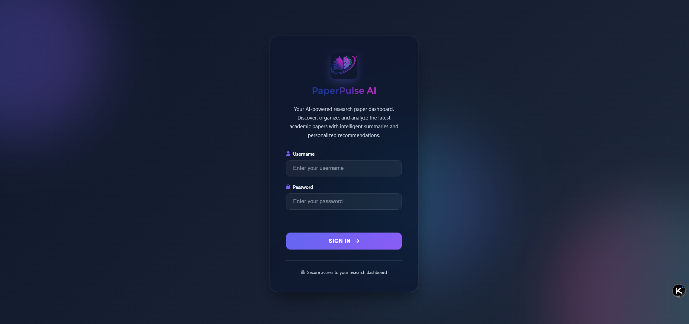
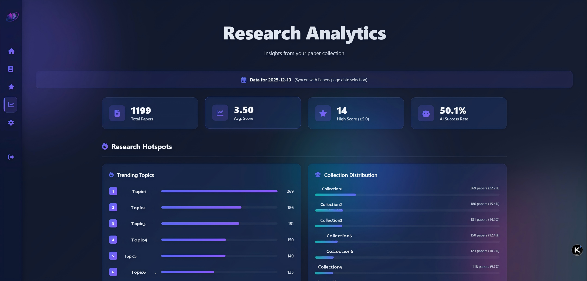

# Daily Paper RSS AI Enhance

**中文** | [English](README_EN.md)

**基于 RSS 订阅的智能学术论文推荐系统**

> 📚 通过 AI 增强和 Zotero 文献库智能排序，自动发现与你研究兴趣相关的最新学术论文。

[](https://www.gnu.org/licenses/agpl-3.0)
[](https://www.python.org/downloads/)
[](https://github.com/astral-sh/uv)

---

## 💡 项目简介

这是一个**本地化运行**的学术论文推荐系统，集成了 RSS 订阅、AI 智能摘要生成和基于 Zotero 文献库的个性化排序功能。

### ✨ 核心特性

- 🎯 **智能排序**：基于你的 Zotero 文献库，通过嵌入向量（Embedding）相似度计算推荐最相关的论文。
- 🤖 **AI 增强**：使用大语言模型（支持本地/在线）生成结构化摘要，包括 TL;DR、研究动机、方法、结果和结论。
- 📡 **多源支持**：自动抓取 arXiv、Nature、Science、Optica、APS 等主流学术期刊的最新论文。
- 🌐 **精美 Web 界面**：响应式设计，支持搜索、筛选、统计分析及永久收藏夹管理。
- 💾 **隐私安全**：所有数据本地存储，支持使用本地 AI（如 Ollama）实现完全隐私。
- 📝 **Markdown 导出**：自动将论文内容转换为 Markdown 格式，方便导入知识库。

---

## 📸 界面预览

| 🔐 登录认证 | 🏠 系统主页 |
| :---: | :---: |
|  |  |

| 📚 论文列表 | 📑 详情与 AI 摘要 |
| :---: | :---: |
|  |  |

| 📊 统计分析 | ⭐ 收藏管理 |
| :---: | :---: |
|  |  |

---

## 🚀 快速开始

### 1. 环境准备
- **Python 3.12+**
- **[uv](https://github.com/astral-sh/uv)** 包管理器 (推荐)

### 2. 安装与配置
```bash
# 克隆仓库
git clone https://github.com/yourusername/Daily_Paper_RSS_AI_Enhance.git
cd Daily_Paper_RSS_AI_Enhance

# 安装依赖
uv sync

# 配置环境变量
cp .env.example .env
```

### 3. 环境变量配置 (`.env`)
在 `.env` 文件中填入以下关键配置：

| 分类 | 变量名 | 说明 |
| :--- | :--- | :--- |
| **API** | `NEWAPI_BASE_URL` | OpenAI 兼容 API 基础地址 |
| | `NEWAPI_KEY_AD` | API 密钥 |
| **Zotero** | `ZOTERO_ID` | Zotero 用户 ID |
| | `ZOTERO_KEY_AD` | Zotero API 密钥 (需读权限) |
| **工具** | `TAVILY_API_KEY` | Tavily 搜索 API (用于抓取摘要) |
| | `NATURE_API_KEY` | Springer Nature API 密钥 |
| **RSS** | `RSS_SOURCES` | RSS 源配置 (格式见下文) |
| | `MODEL_NAME` | AI 摘要模型 (如 `gpt-4o`, `qwen2.5-72b`) |
| | `EMBEDDING_MODEL` | 嵌入模型 (如 `text-embedding-3-small`) |
| | `OUTPUT_LANGUAGE` | 输出语言 (`Chinese` / `English`) |

---

## 🔧 进阶配置说明

### 📡 RSS 来源格式
`RSS_SOURCES` 格式为：`来源:分类1+分类2,来源2:分类1`
- **arXiv**: `arxiv:physics+quant-ph+cs.AI`
- **Nature**: `nature:nature+nphoton+nphys+ncomms`
- **Science**: `science:science+sciadv`
- **Optica**: `optica:optica`
- **APS**: `aps:prl+prx`

### ⚡ 运行模式

#### 自动定时运行
```bash
uv run main.py
```
- **每日任务** (08:00): 抓取新论文、排序、生成 AI 摘要。
- **每周任务** (周日 10:00): 根据最新 Zotero 库重排历史论文。

#### 立即执行模式
```bash
# 立即执行当日任务
uv run main.py --immediate --mode daily

# 立即执行指定日期任务
uv run main.py --immediate --mode daily --date 2026-01-22

# 立即重排历史文章
uv run main.py --immediate --mode weekly
```

#### 启动 Web 界面
```bash
uv run api_server.py
```
默认访问：`http://127.0.0.1:8000`

---

## 📁 项目结构

```text
Daily_Paper_RSS_AI_Enhance/
├── ai/                  # AI 核心逻辑 (摘要生成、Zotero 推荐、翻译)
├── fetcher/             # RSS 抓取与摘要提取逻辑
├── md/                  # Markdown 转换工具
├── data/                # 数据存储
│   ├── cache/           # RSS 缓存、Zotero 索引、收藏数据
│   └── md_files/        # 自动生成的 Markdown 论文集
├── assets/              # 界面截图与图标
├── css/ & js/           # Web 前端资源
├── api_server.py        # Web 后端 (Flask)
├── main.py              # 主程序入口 (定时调度/立即执行)
├── config.py            # 配置管理类
├── .env.example         # 环境变量模板
└── pyproject.toml       # 依赖管理 (uv)
```

---

## 📊 数据格式示例
每篇论文以 JSONL 格式存储，包含：`journal`, `id`, `title`, `authors`, `published`, `score` (Zotero 相关性), `AI` (结构化摘要) 等字段。

---

## ⚠️ 免责声明
在使用本项目前，请务必阅读并理解 [免责声明](DISCLAIMER.md)。本项目生成的 AI 内容仅供参考，不应作为研究决策的唯一依据。

---

## 📋 TODO & 已知问题
- [ ] 优化 Science/APS 抓取稳定性（易受拦截）
- [ ] 增加更多 RSS 源支持
- [ ] Obsidian/Logseq 联动增强
- [x] Web 界面统计分析页面
- [x] Markdown 导出功能

---

## 📝 许可与致谢
本项目采用 [AGPL-3.0](LICENSE) 许可证。
感谢 [daily-arXiv-ai-enhanced](https://github.com/dw-dengwei/daily-arXiv-ai-enhanced) 和 [zotero-arxiv-daily](https://github.com/TideDra/zotero-arxiv-daily) 提供的灵感与基础代码。
