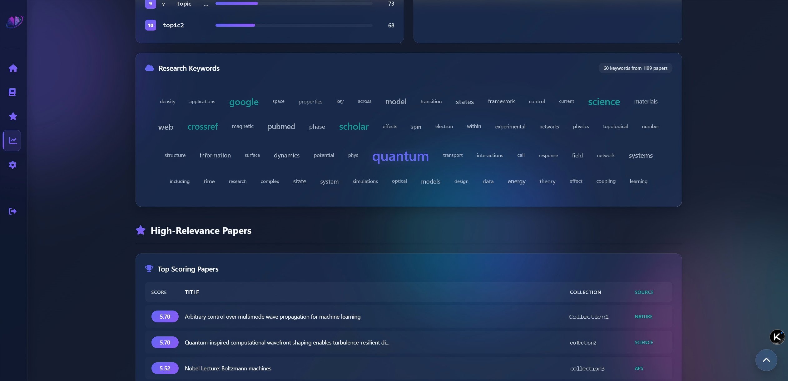
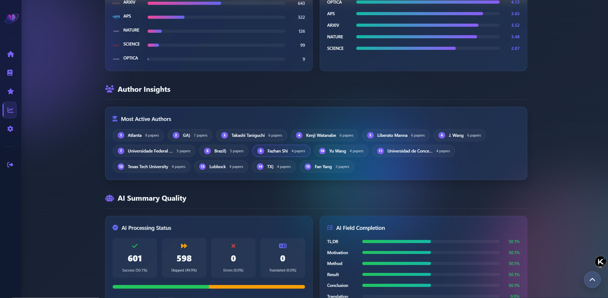

# Daily Paper RSS AI Enhance

[中文版](README.md) | **English** 
⚠️ *This is an AI-translated version, for reference only, and its accuracy is not guaranteed.*

**Intelligent Academic Paper Recommendation System Based on RSS Subscriptions**

> 📚 Automatically discover the latest academic papers related to your research interests through AI enhancement and Zotero library-based intelligent ranking

[](https://www.gnu.org/licenses/agpl-3.0)
[](https://www.python.org/downloads/)
[](https://github.com/astral-sh/uv)

---

## 💡 Project Overview

<p align="center">
  
</p>

This is a **locally-run** academic paper recommendation system that integrates RSS subscriptions, AI-powered summary generation, and personalized ranking based on your Zotero library. The system can:

- 📡 **Auto-fetch** latest papers from multiple academic journals (arXiv, Nature, etc.)
- 🤖 **AI Enhancement**: Generate structured Chinese/English summaries using large language models
- 🎯 **Smart Ranking**: Recommend the most relevant papers based on your Zotero library through embedding vector similarity
- 💾 **Local Processing**: All data is stored and processed locally with full control; only when using online providers will some data be uploaded to provider servers
- 🌐 **Web Interface**: Provides a beautiful responsive interface with search, filtering, and favorites features

**RSS Source Limitations ⚠️ Under Active Development**: 
- Currently supported RSS sources: **arXiv**, **Nature Series**, **Science Series**, **Optica**, **APS Series**
- Most academic journal RSS feeds don't include abstracts, requiring additional web scraping
- Current approach: first try official API requests, then Tavily search API (with 3 retries on failure), all data is public and doesn't involve copyright issues
- Science and APS websites are easily blocked, scraping stability is poor; solutions are welcome

**Legal Reminder**: 
This project is for learning and exchange purposes only. Please comply with local laws and regulations, especially regarding data scraping.

## ✨ Core Features

### 🎯 Data Privacy First (Supports Local AI Providers like Ollama, LM Studio)
- ✅ All data processed on your local machine
- ✅ No cloud service dependencies - full control over your data
- ✅ JSONL-based storage, transparent and easy to migrate
- ✅ **Consumer GPU Compatible**: With default configuration (qwen3-30b-a3b-instruct-2507, qwen3-Embedding-8B), can run locally on RTX 4090 (24GB)

### 🤖 AI Smart Enhancement
- ✅ Structured summaries using OpenAI-compatible large language models
- ✅ Generated content: Core takeaways (TL;DR), research motivation, methodology, results, conclusions, abstract translation
- ✅ **Cost-effective**: With Zotero recommendations, AI content is only generated for relevant papers
- ✅ Configurable models (default: qwen3-30b-a3b-instruct-2507, deepseek-chat, etc.)
- ✅ Supports Chinese/English output, switchable in settings page

### 📚 Smart Zotero Integration
- ✅ Rank papers based on similarity to your existing Zotero library
- ✅ Semantic matching using embedding models (default: Qwen3-Embedding-8B)
- ✅ Time-decay weighting for recently added references
- ✅ Auto-detect collection changes and re-rank

### 📡 Multi-Source RSS Support
- ✅ **arXiv**: Physics, Quantum Physics, Condensed Matter, Nonlinear Science, AI, CV, etc.
- ✅ **Nature Series**: Nature, Nature Photonics, Nature Physics, Nature Communications, etc.
- ✅ **Science Series**: Science, Science Advances, etc.
- ✅ **Optica Series**: Optica, etc.
- ✅ **APS Series**: Physical Review Letters, Physical Review X, Reviews of Modern Physics, etc.
- ✅ Extensible architecture for adding more sources

### 🌐 Beautiful Web Interface
- ✅ **Login Authentication**: Protect your research data with login required access
- ✅ **Statistics & Analytics Page**: Research hotspots, paper trends, AI quality metrics visualization
- ✅ Filter by collection
- ✅ Filter by journal
- ✅ Date range filtering
- ✅ Keyword search
- ✅ Persistent favorites system (with multi-folder management)
- ✅ Favorites data stored locally
- ✅ Responsive design for desktop and mobile

---

## 📸 Screenshots

### 🔐 Login Page
Clean login interface displaying website logo and introduction, protecting your research data


### 🏠 Home Page
Displays recent update information and system status


### 📚 Papers Page
- Filter by date, journal, Zotero collection
- Each paper card displays clear Zotero collection tags


### 📑 Paper Details
Displays complete AI-generated summary including research motivation, methods, results, and conclusions
<p align="center">
  
</p>

### ⭐ Persistent Favorites System
Supports multi-folder categorization, all favorites data permanently saved locally, retained after browser restart


### 📊 Statistics & Analytics Page
Comprehensive research data visualization including:
- Research hotspots and keyword cloud
- High-relevance paper recommendations
- Journal source distribution
- Author statistics
- AI summary quality metrics





---

## 🚀 Quick Start

### 💻 Requirements

- **Python 3.12+**
- **[uv](https://github.com/astral-sh/uv)** package manager
- **OpenAI-compatible API** access (or local LLM like Ollama)
- **Zotero** account and API key
- **Tavily** account and API key

### 📥 Installation

#### 1. Clone the Repository

```bash
git clone https://github.com/yourusername/Daily_Paper_RSS_AI_Enhance.git
cd Daily_Paper_RSS_AI_Enhance
```

#### 2. Install Dependencies

```bash
uv sync
```

#### 3. Configure Environment Variables

Copy `.env.example` and rename to `.env`, then configure:

```bash
# API Configuration
# Base URL for OpenAI-compatible API
NEWAPI_BASE_URL=https://api.example.com/v1

# API key for AI enhancement and translation
NEWAPI_KEY_AD=your_api_key_here

# Zotero Configuration
# Your Zotero user ID (found in Zotero settings -> Feeds/API)
ZOTERO_ID=your_zotero_id

# Zotero API key (generate at https://www.zotero.org/settings/keys)
ZOTERO_KEY_AD=your_zotero_api_key

# Tavily Configuration
# API key for Tavily web search (get at https://tavily.com)
TAVILY_API_KEY=your_tavily_api_key

# Nature API Configuration
# API key for Springer Nature API (get at https://dev.springernature.com)
NATURE_API_KEY=your_nature_api_key

# Authentication Configuration
# Username for web login
AUTH_USERNAME=admin
# Password for web login (change this to a secure password)
AUTH_PASSWORD=your_secure_password
# Secret key for session management (generate a random string)
SECRET_KEY=your_random_secret_key

# Logging Configuration
# Log level: DEBUG, INFO, WARNING, ERROR, CRITICAL
LOG_LEVEL=INFO
```

**Key Acquisition Guide:**

- **OpenAI-compatible provider API_KEY and BASE_URL**: When using OpenAI-compatible providers, simply provide the corresponding Base URL and key
(Optional) *Or use NEW-API to manage local and cloud model interfaces: Visit [https://github.com/QuantumNous/new-api](https://github.com/QuantumNous/new-api) to generate. New-API is an open-source AI gateway providing access to multiple AI providers (*Online*: OpenAI, Gemini, DeepSeek, Qwen, SiliconFlow; *Local*: Ollama, LMstudio, etc.)*
- **Zotero User ID**: Get from [https://www.zotero.org/settings/keys](https://www.zotero.org/settings/keys)
- **Zotero API Key**: Generate at [https://www.zotero.org/settings/keys/new](https://www.zotero.org/settings/keys/new) (read permission required)
- **Nature API Key**: Apply at [Springer Nature API Portal](https://dev.springernature.com/)
- **Tavily API Key**: Apply at [Tavily API Platform](https://tavily.com/)
- **Authentication Configuration**: Set login username, password, and session key for web interface access control

#### 4. Daily Operation

```bash
uv run main.py
```
The program will run continuously, automatically executing tasks on schedule:
- 📅 **Daily Tasks** (auto-execute at 08:00)
1. Fetch latest papers from configured RSS sources
2. Rank papers using Zotero library embeddings
3. Generate AI summaries for relevant papers
4. Update file list for web interface
- 📊 **Weekly Check** (auto-execute Sundays at 10:00)
1. Re-rank all papers based on latest Zotero collections
2. Check and fill in missing AI-generated content

#### 5. View Results

To use the **persistent favorites** feature, we recommend using the built-in Flask API server:

```bash
uv run api_server.py
```

Default server starts at `http://127.0.0.1:8000`, then visit this address in your browser. First-time access requires login with configured username and password.

**Custom Port and Host**:

```bash
# Specify host and port
uv run api_server.py --host 0.0.0.0:8080
```

**Features**:
- ✅ **Login Authentication**: Protect data security, prevent unauthorized access
- ✅ Favorites data permanently saved in `data/cache/favorites.json`
- ✅ Folder configuration saved in `data/cache/favorites_folders.json`
- ✅ Cross-device access support (change host to 0.0.0.0)
- ✅ Auto-persistent data, no manual save needed

#### 6. Custom Configuration (Optional)

When running `main.py` and `test.py`, you can customize the following parameters:

```bash
--sources "arxiv:physics+quant-ph+cond-mat+nlin,nature:nature+nphoton+ncomms"
  # RSS sources and categories (e.g., arxiv:physics+quant-ph,nature:nature+nphoton)
--model_name "qwen3-30b-a3b-instruct-2507"
  # Model name for AI content generation
--embedding_model "qwen3-embedding-8b"
  # Model name for embedding generation
--language "Chinese"
  # Output language (Chinese or English)
--max_workers 4
  # Number of parallel worker threads, increase to speed up AI processing
```

#### 7. Test Mode (Optional)

Execute tasks immediately by modifying the bottom of `test.py`:

```python
if __name__ == '__main__':
    args = parse_args()
    main(args)              # Fetch new papers, rank, and generate AI summaries
    # main_week_check(args)   # Re-rank all papers and fill missing AI content
```

---

## 📁 Project Structure

```
Daily_Paper_RSS_AI_Enhance/
├── .venv/                               # Python virtual environment
├── ai/                                  # AI enhancement and ranking modules
│   ├── enhance.py                       # LLM-based paper summary generation
│   ├── structure.py                     # Data structures for AI output
│   ├── system.txt                       # System prompt template
│   ├── template.txt                     # User prompt template
│   ├── translate.py                     # Summary translation module
│   └── zotero_recommender.py            # Embedding-based Zotero ranking
├── fetcher/                             # RSS fetching modules
│   ├── abstract_extracter.py            # Abstract extractor (Nature API/Tavily fallback chain)
│   └── rss_fetcher.py                   # Universal multi-source RSS fetcher
├── data/                                # Paper data storage (JSONL format)
│   └── cache/                           # RSS cache, update logs, and favorites data
│       ├── favorites.json               # Persistent favorites data
│       ├── favorites_folders.json       # Favorites folder list
│       ├── favorites_papers.json        # Favorites paper details cache
│       ├── file-list.txt                # Paper data file name list
│       ├── rss_cache_*.json             # RSS cache for each source
│       ├── update.json                  # Recent update log
│       ├── zotero_corpus_timestamp.txt  # Zotero library fetch timestamp
│       └── zotero_corpus.pkl            # Zotero library data cache
├── assets/                              # Static resource files
├── css/                                 # Stylesheets
│   └── style.css                        # Main stylesheet
├── js/                                  # JavaScript scripts
│   └── app.js                           # Main application logic
├── .env.example                         # Environment variable template
├── .gitignore                           # Git ignore rules
├── api_server.py                        # Flask API server (favorites persistence)
├── config.py                            # Centralized configuration module (loads .env)
├── DISCLAIMER.md                        # Disclaimer (Chinese)
├── DISCLAIMER_EN.md                     # Disclaimer (English)
├── index.html                           # Main web interface
├── LICENSE                              # AGPL-3.0 License
├── logger_config.py                     # Logging configuration
├── main.py                              # Main program entry (scheduled task dispatcher)
├── pyproject.toml                       # Project dependencies
├── README.md                            # Chinese README
├── README_EN.md                         # This file
├── refresh_favorites_cache.py           # Favorites cache refresh tool
├── test.py                              # Test file
└── uv.lock                              # Dependency lock file
```

---

## 🔧 Configuration Details

### 📡 RSS Source Configuration

Currently supported RSS sources:
- ✅ **arXiv**: Fully supported, includes abstracts
- ✅ **Nature Series**: RSS obtainable, abstracts via official API, relatively stable
- ⚠️ **Science**: RSS obtainable, abstracts via Tavily API, easily blocked, poor stability
- ⚠️ **Optica**: RSS obtainable, abstracts via Tavily API, easily blocked, poor stability
- ⚠️ **APS (Physical Review)**: RSS obtainable, abstracts via Tavily API, easily blocked, poor stability

Modify the `--sources` parameter in `main.py`:

```bash
--sources "arxiv:physics+quant-ph+cond-mat+nlin,nature:nature+nphoton+ncomms"
```

**Format**: `source:category1+category2+category3,source2:category1+category2`

#### Available arXiv Categories:

| Category Code | Description |
|--------------|-------------|
| `physics` | Physics |
| `quant-ph` | Quantum Physics |
| `cond-mat` | Condensed Matter Physics |
| `nlin` | Nonlinear Science |
| `cs.AI` | Artificial Intelligence |
| `cs.CV` | Computer Vision |
| `cs.CL` | Computation and Language |
| `cs.LG` | Machine Learning |

Full list at: [arXiv Category Taxonomy](https://arxiv.org/category_taxonomy)

#### Available Nature Journals:

| Journal Code | Journal Name |
|-------------|--------------|
| `nature` | Nature |
| `nphoton` | Nature Photonics |
| `nphys` | Nature Physics |
| `ncomms` | Nature Communications |
| `natrevphys` | Nature Reviews Physics |
| `lsa` | Light: Science & Applications |
| `natmachintell` | Nature Machine Intelligence |

Full list at: [Nature Portfolio](https://www.nature.com/siteindex)

#### Available Science Journals (Experimental, Unstable):

| Journal Code | Journal Name |
|-------------|--------------|
| `science` | Science |
| `sciadv` | Science Advances |

#### Available Optica Journals (Experimental):

| Journal Code | Journal Name |
|-------------|--------------|
| `optica` | Optica |

#### Available APS Journals (Experimental, Unstable):

| Journal Code | Journal Name |
|-------------|--------------|
| `prl` | Physical Review Letters |
| `prx` | Physical Review X |

### 🤖 LLM Model Configuration

Modify the `--model_name` parameter:

```bash
--model_name "qwen3-30b-a3b-instruct-2507"
# or
--model_name "deepseek-chat"
# or
--model_name "gpt-4o"
# or any OpenAI-compatible model
```

**Note**: DeepSeek models use the `langchain_deepseek` library, other models use `langchain_openai`.

### 🔢 Embedding Model Configuration

Modify the `--embedding_model` parameter:

```bash
--embedding_model "qwen3-embedding-8b"
# or
--embedding_model "text-embedding-3-small"
# or any OpenAI-compatible embedding model
```

### 🌍 Output Language Configuration

Modify the `--language` parameter:

```bash
--language "Chinese"
# or
--language "English"
```

You can also switch languages in the web interface settings page; the system will automatically load the corresponding language data files.

### ⚙️ Parallel Processing Configuration

Modify the `--max_workers` parameter to control AI processing parallelism:

```bash
--max_workers 4  # Use 4 parallel threads
```

**Note**: 
- Increasing parallel threads can significantly speed up processing
- But also increases API call frequency and costs
- Recommend setting carefully based on API rate limits and budget

### 🎯 Smart Filtering Configuration

The project automatically filters papers based on Zotero similarity scores:

- **Score Threshold**: 3.6 (out of 10)
- **Processing Strategy**: Only generate AI summaries for papers with score ≥ 3.6
- **Cost Optimization**: Avoid spending API quota on irrelevant papers

To modify the threshold, edit the condition in `ai/enhance.py`:

```python
if item and item["score"]["max"] < 3.6:  # Modify this value
    logger.debug(f"[{source}] Skipping irrelevant item: {item['id']}")
    item['AI'] = 'Skip'
    return item
```

### ⚡ Runtime Mode Description

The project uses the `schedule` library for scheduled tasks by default, requiring the program to run continuously.

**Modify Scheduled Task Times**: Edit the bottom of `main.py`:

```python
# Modify daily task time (default 08:00)
schedule.every().day.at("08:00").do(main, args=args).tag('daily-tasks')

# Modify weekly task time (default Sunday 10:00)
schedule.every().sunday.at("10:00").do(main_week_check, args=args).tag('weekly-tasks')
```

---

## 📊 Data Format Description

Paper data is stored in JSONL format, one JSON object per line, with the following structure:

```json
{
  "journal": "Nature Photonics",
  "id": "10.1038/s41566-024-01234-5",
  "pdf": "https://www.nature.com/articles/s41566-024-01234-5.pdf",
  "abs": "https://doi.org/10.1038/s41566-024-01234-5",
  "title": "Paper Title",
  "summary": "Paper abstract text...",
  "authors": ["Author1", "Author2"],
  "published": "2025-11-03",
  "category": "Quantum Optics",
  "score": {
    "Collection1": 8.5,
    "Collection2": 6.2,
    "max": 8.5
  },
  "collection": ["Collection1"],
  "AI": {
    "tldr": "One-sentence summary",
    "motivation": "Research motivation...",
    "method": "Research methodology...",
    "result": "Research results...",
    "conclusion": "Conclusions...",
    "summary_translated": "Original abstract translation...",
  }
}
```

### Field Descriptions:

- **journal**: Journal name
- **id**: Paper unique identifier (arXiv ID or DOI)
- **pdf**: PDF download link
- **abs**: Abstract page link
- **title**: Paper title
- **summary**: Original paper abstract
- **authors**: Author list
- **published**: Publication date
- **category**: Category/topic
- **score**: Relevance scores to each Zotero collection
- **collection**: Recommended Zotero collection list
- **AI**: AI-generated structured summary

---

## 📋 TODO List

- [ ] **Improve Stability**: Resolve Science and APS blocking issues
- [x] **Add More RSS Sources**: PNAS, Physical Review Letters, JACS, etc.
- [x] **Web Performance Optimization**: Currently, opening the page loads all articles by default, causing long wait times
- [x] **Zotero Request Optimization**: Weekly checks make multiple repeated Zotero requests; need caching mechanism for weekly checks to request only once while daily updates remain unaffected
- [x] **Add Analytics Page**: Paper trend analysis and visualization (research hotspots, source distribution, AI quality metrics, etc.)
- [x] **Login Authentication System**: Protect website data security with login required access
- [x] **Markdown**: Convert paper content to markdown files
- [ ] **Obsidian Integration**: Import to Obsidian

---

## 🐛 Known Issues

- **Stability**: Science and APS websites may be blocked, scraping success rate is unstable

---

## 📝 Open Source License

This project is released under the **GNU Affero General Public License v3.0 (AGPL-3.0)** license. See the [LICENSE](LICENSE) file for details.

### Why AGPL-3.0?

AGPL-3.0 ensures:
- ✅ Freedom to use, modify, and distribute
- ✅ Requires sharing modifications (even when provided as a network service)
- ✅ Prevents closed-source forks
- ✅ Compatible with upstream dependencies

---

## 🙏 Acknowledgments

This project builds upon and integrates code from these excellent open-source projects:

### Primary Sources

1. **[daily-arXiv-ai-enhanced](https://github.com/dw-dengwei/daily-arXiv-ai-enhanced)** by [@dw-dengwei](https://github.com/dw-dengwei)
   - Inspired the RSS fetching and AI summary generation workflow
   - Provided the web interface design foundation
   - Reference implementation for LLM integration

2. **[zotero-arxiv-daily](https://github.com/TideDra/zotero-arxiv-daily)** by [@TideDra](https://github.com/TideDra)
   - Licensed under AGPL-3.0
   - Core algorithm for Zotero-based paper ranking
   - Embedding similarity calculation and time-decay weighting
   - Foundation architecture for the recommendation system

### Core Dependencies

- [pyzotero](https://github.com/urschrei/pyzotero) - Zotero API client
- [feedparser](https://github.com/kurtmckee/feedparser) - RSS/Atom feed parser
- [langchain](https://github.com/langchain-ai/langchain) - LLM framework
- [langchain-openai](https://github.com/langchain-ai/langchain) - OpenAI LLM integration
- [langchain-deepseek](https://github.com/langchain-ai/langchain-deepseek) - DeepSeek LLM integration
- [OpenAI Python SDK](https://github.com/openai/openai-python) - API client
- [Flask](https://github.com/pallets/flask) - Web framework (for API server)
- [Flask-CORS](https://github.com/corydolphin/flask-cors) - Flask Cross-Origin Resource Sharing support
- [requests](https://github.com/psf/requests) - HTTP library
- [beautifulsoup4](https://www.crummy.com/software/BeautifulSoup/) - HTML parsing library
- [numpy](https://github.com/numpy/numpy) - Numerical computing library
- [schedule](https://github.com/dbader/schedule) - Scheduled task library
- [tqdm](https://github.com/tqdm/tqdm) - Progress bar library
- [tavily-python](https://github.com/tavily-ai/tavily-python) - Python integration for Tavily search API (for obtaining public abstract data)

### AI Gateway

- [new-api](https://github.com/QuantumNous/new-api) - Open-source AI gateway

### AI Coding Assistant

- [Qoder](https://qoder.com/) - This project was completed with the assistance of Qoder and Qoder CLI

---

## ⚠️ Disclaimer

### General Disclaimer

This software is provided "as is" without any express or implied warranties. The developers and contributors of this project make no representations or warranties regarding the accuracy, completeness, reliability, or suitability of the software.

### [Full Details](DISCLAIMER_EN.md)

---

**Last Updated**: 2025-12-12

---

**If this project helps you, please Star! ⭐**
